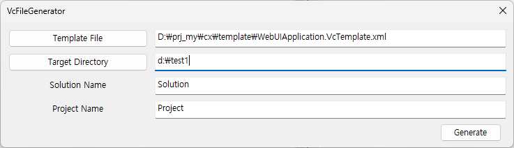

# VcFileGenerator를 사용한 프로젝트 생성 및 설정

## 개요
이 문서는 `VcFileGenerator`를 사용하여 Visual Studio 프로젝트를 생성하고 설정하는 방법을 설명합니다.  
`VcFileGenerator`는 템플릿 파일을 기반으로 프로젝트 파일(.vcxproj)과 솔루션 파일(.sln)을 자동으로 생성하는 도구입니다.



## 프로젝트 생성

### VcFileGenerator 실행
먼저, `VcFileGenerator` 프로그램을 실행합니다.  
이 프로그램은 Visual Studio 프로젝트와 솔루션 파일을 생성하고 템플릿 파일들을 자동으로
복사합니다.

### 템플릿 파일 선택
`VcFileGenerator`가 실행하고, `cx\template\` 디렉토리에서 템플릿 파일(*.VcTemplate.xml)을 선택합니다.  
이 템플릿 파일은 프로젝트 설정을 정의하는 XML 파일입니다.

#### 템플릿 파일 내용 수정
선택한 템플릿 파일의 내용을 확인하고, 필요한 경우 수정합니다. 특히, `cxDirectory` 경로를 올바르게 설정해야 합니다.

##### 예제 템플릿 파일 내용

```

<?xml version="1.0" encoding="UTF-8"?>
<VcTemplate>

	<Settings
		cxDirectory="D:\prj_my\cx\"
		SourceDirectory=".\Application\"
		ClCompile_PrecompiledHeader=".\src\pch.cpp"
		/>

	<ItemFiles>
		<Item File="cx.VcItem.xml"/>
		<Item File="Application.VcItem.xml"/>
	</ItemFiles>
	
	<ConfigurationFiles>
		<Item Name="Release|x64"   File="Vc.App.Config.Release.x64.txt"/>
		<Item Name="Debug|x64"     File="Vc.App.Config.Debug.x64.txt"/>
		<Item Name="Release|Win32" File="Vc.App.Config.Release.Win32.txt"/>
		<Item Name="Debug|Win32"   File="Vc.App.Config.Debug.Win32.txt"/>
	</ConfigurationFiles>
  
</VcTemplate>

 ```
  
- `cxDirectory` 경로는 맞게 수정합니다.

###  나머지 설정 입력
템플릿 파일을 수정한 후, `VcFileGenerator` 프로그램에서 나머지 설정을 입력합니다.  
여기에는 대상 디렉토리, 솔루션 이름, 프로젝트 이름이 포함됩니다.

###  Generate 버튼 클릭
모든 설정을 완료한 후, `Generate` 버튼을 클릭하여 프로젝트 파일과 솔루션 파일을 생성합니다.   
생성된 파일은 지정한 대상 디렉토리에 저장됩니다.


 